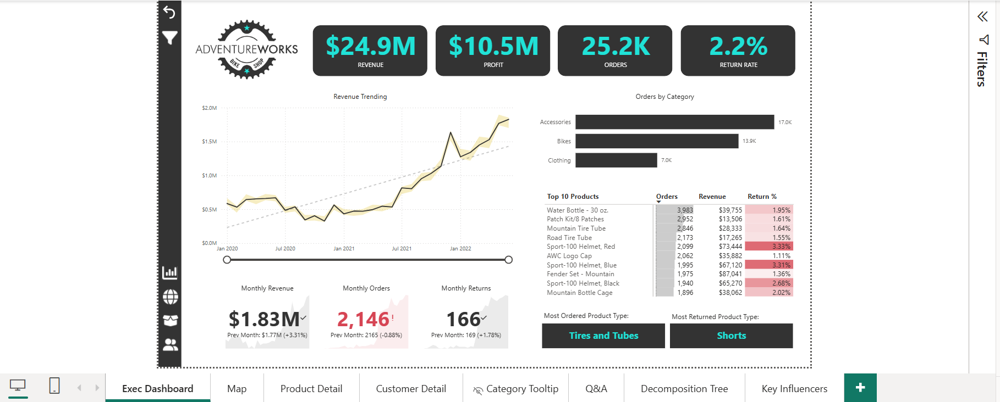
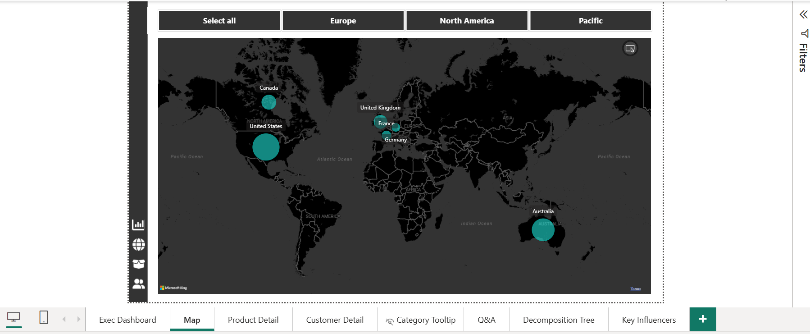
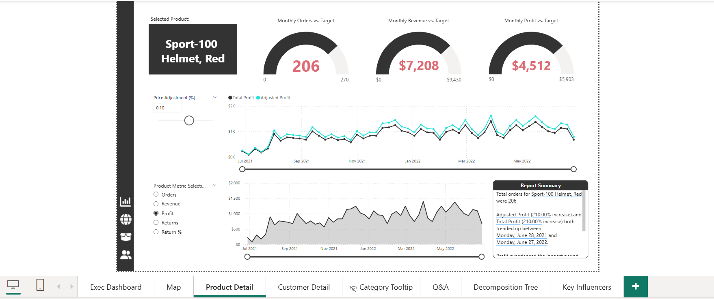
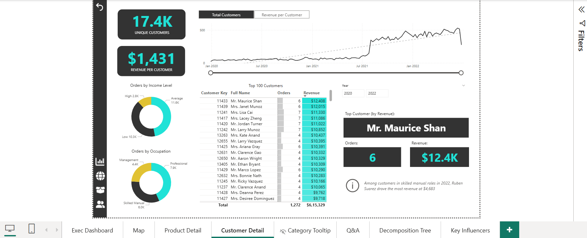
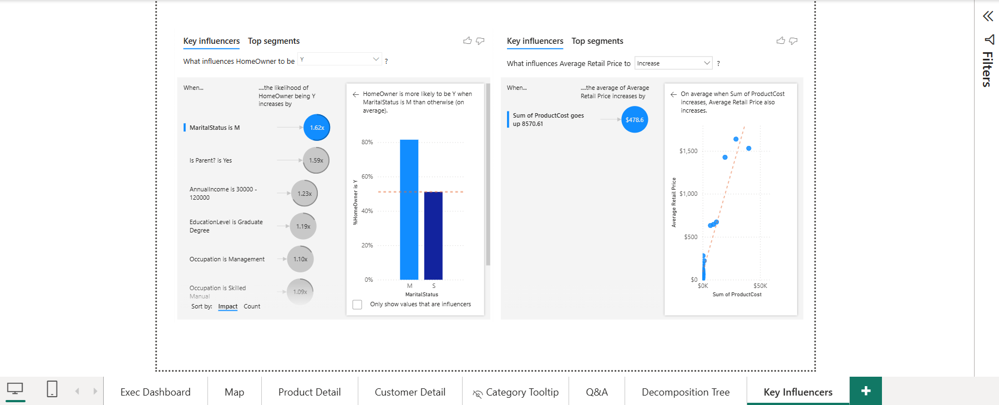

# Sales Performance Dashboard

This project showcases a **Power BI dashboard** developed to analyze sales data and derive actionable insights.

## Project Overview

- **Tool Used**: Power BI
- **Objective**: To explore and visualize sales performance metrics
- **Key Metrics Analyzed**: 
  - Sales by Product
  - Sales by Region
  - Sales by Time (Monthly/Yearly)
  - Sales by Category

## Features

- Trend Analysis over Time
- Category-wise Sales Performance
- Region-wise Contribution
- Product-level Performance Drilldown

## Screenshots

| Overview | Region-wise | Product-wise |
|----------|-------------|--------------|
|  |  |  |

| Monthly Trend | Category Insight |
|---------------|------------------|
|  |  |

## Project File

- The `.pbix` file is included here: `sales_dashboard.pbix`

## Skills Demonstrated

- Data Modeling in Power BI
- DAX Calculations
- Interactive Visualizations
- Drill-Through and Slicer Techniques
- Dashboard Design Best Practices

## LinkedIn

Connect with me on [LinkedIn](https://www.linkedin.com/in/vallarasu-karnan-a276ab26b)

